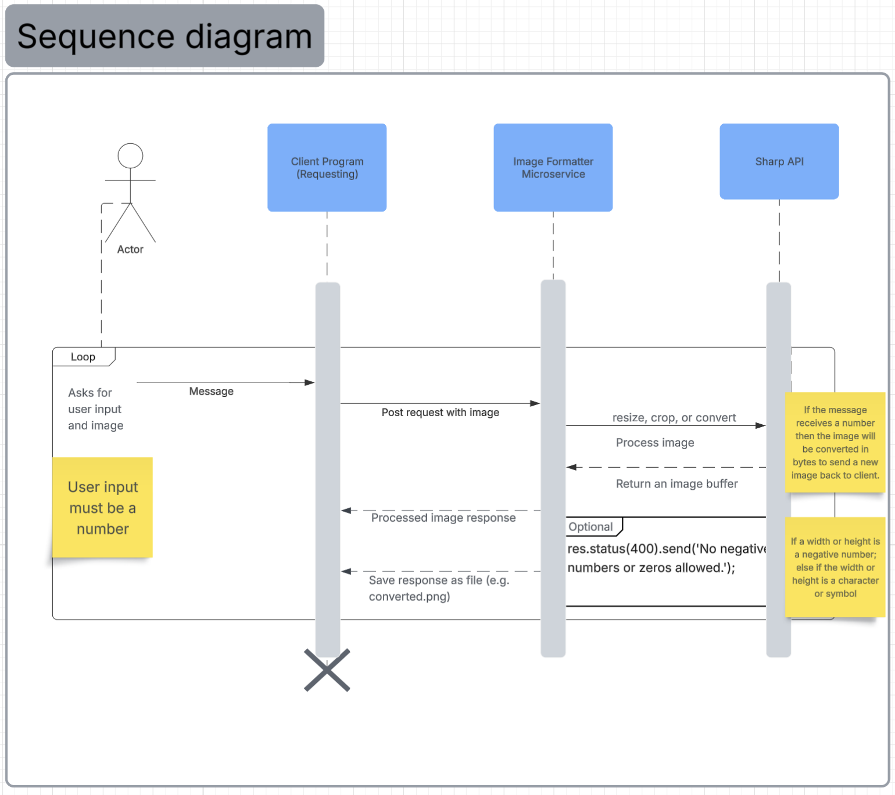

# Image Formatter Microservice
This repository contains a microservice for formatting an image provided by the user.

The microservice supports three image-processing operations using the Sharp library:

1. Resize an image
2. Crop an image
3. Convert an image between PNG and JPEG formats

The microservice is built with Node.js, Express.js, and Sharp.

For more information on Sharp, please check out this link: https://sharp.pixelplumbing.com/api-output/#_top

# Requesting Data

The microservice communicates over HTTP using POST requests and multipart form data.

The client must provide: An uploaded image file using the field name `img`

## Resize Endpoint: POST/resize
Resizing an image. Sharp saves the image as bytes using toBuffer(). The resized buffer will be sent back to the user to download.

Fields required are a img (file), width, and height. Please use numbers, otherwise you will get an error!

Example:
1. Upload a photo either in .png, jpeg, or jpg.
2. Provide a width. `width = 300`
3. Provide a height. `height = 200`

## Crop Endpoint: POST/crop
The crop operation extracts a region of the input image, saving in the same format. Specify the width, height, and optional offsets to control the cropping area. Sharp will save the image using toBuffer() into bytes in memory for cropping, which will get sent back to the user.

Fields required are a img (file), left, top, width, height. Please use numbers, otherwise you will get an error. 

Example:
1. Upload an image (.png, .jpg, or .jpeg) to crop a desired section.
2. Provide a number for the left offset. `left = 100`
3. Provide a number for the top offset. `top = 50`
4. Give a width as a number. `width = 300`
5. Give a height as a number. `height = 200`

## Convert Endpoint: POST/convert
Output to a given format.

Fields required are a img (file) and toImgType, which is a text of png, jpg, or jpeg.

Example:
1. Upload an image
2. toImgType will be either a .png, .jpg, or .jpeg. `toImgType = png`

# Receiving Data
After processing, the microservice returns the modified image as binary data in the HTTP response. The response will contain a content-type header that indicates the image format and the processed image buffer as the response body.

The client program should save the response body as an image file.

Example (data received):
If the client sends a request to `/convert` with `img = photo.jpg` and `toImgType = png`

The microservice returns a binary image data representing the converted PNG file.

The client should save the response to a file such as: `converted.png`

The saved file can then be opened normally.

# UML Sequence Diagram:

Link to UML Sequence Diagram for commenting: https://lucid.app/lucidchart/fb0a339e-2839-46d1-bfdd-a662da1a4425/edit?viewport_loc=736%2C355%2C1745%2C1280%2C0_0&invitationId=inv_dcf3ab4e-5264-4caf-8407-c0b7fc64009f

### Authors: Oren Paley and Emily Tsui
